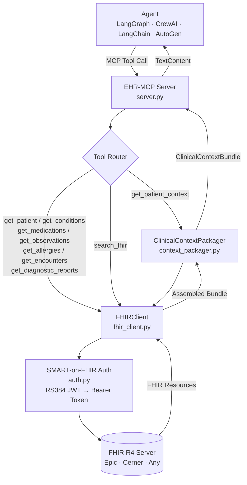

<div align="center">

<br />

<h1>⚕️ EHR-MCP</h1>

**Framework-agnostic interoperability for multi-agent healthcare AI systems.**
One protocol layer. Any EHR. Any agent framework.

<br />
### EHR-MCP

**Framework-agnostic interoperability for multi-agent healthcare AI systems.**  
One protocol layer. Any EHR. Any agent framework.

<br />

[](https://python.org)
[](https://hl7.org/fhir/R4/)
[](https://modelcontextprotocol.io)
[](https://hl7.org/fhir/smart-app-launch/backend-services.html)
[](#ehr-compatibility)
[](LICENSE)

<br />

[Docs](./docs/) · [MCP Tool Reference](#mcp-tool-reference) · [Quick Start](#getting-started) · [Roadmap](#roadmap)

<br />

</div>

---

## The Problem

Every healthcare AI agent needs patient data. But today, each agent team builds their own FHIR client, their own auth layer, their own data schema — from scratch. The result is fragmented, duplicated infrastructure that doesn't compose across agents.

EHR-MCP solves this with a single, framework-agnostic interoperability layer: a Model Context Protocol (MCP) server that translates clinical EHR data into structured context **any agent can consume**.

---

## How It Works

```
Agent (LangGraph / CrewAI / LangChain / AutoGen)
        │
        │  MCP Tool Call: get_patient_context(patient_id)
        ▼
   ┌─────────────────────────────────────────┐
   │            EHR-MCP Server               │
   │                                         │
   │  ┌─ SMART-on-FHIR Auth (RS384 JWT) ──┐  │
   │  ├─ FHIR R4 Resource Fetch ──────────┤  │
   │  └─ ClinicalContextBundle Assembly ──┘  │
   └─────────────────────────────────────────┘
        │
        ▼
   Structured ClinicalContextBundle → returned to agent
```



---

## MCP Tool Reference

| Tool | FHIR Resource(s) | Description |
|---|---|---|
| `get_patient_context` | Bundle (all) | Full clinical context bundle — the primary tool for any workflow agent |
| `get_patient` | `Patient` | Demographics, identifiers, contact info |
| `get_conditions` | `Condition` | Active diagnoses with ICD-10 codes |
| `get_medications` | `MedicationRequest` | Active prescriptions with dosage and prescriber |
| `get_observations` | `Observation` | Labs and vitals with LOINC codes and values |
| `get_allergies` | `AllergyIntolerance` | Allergy list with reaction severity |
| `get_encounters` | `Encounter` | Visit history with type, class, and dates |
| `get_diagnostic_reports` | `DiagnosticReport` | Imaging, pathology, and procedure reports |
| `search_fhir` | Any `FHIRResourceType` | Raw FHIR search for advanced agent use cases |

---

## ClinicalContextBundle

Every `get_patient_context` call returns a typed `ClinicalContextBundle` — a Pydantic v2 model that gives downstream agents a **consistent, predictable data contract** regardless of which EHR vendor is on the other end.

```python
class ClinicalContextBundle(BaseModel):
    patient_id: str
    patient: Optional[dict]           # FHIR Patient resource
    conditions: List[dict]            # Active Condition resources
    medications: List[dict]           # Active MedicationRequest resources
    allergies: List[dict]             # AllergyIntolerance resources
    observations: List[dict]          # Observation resources (labs + vitals)
    encounters: List[dict]            # Encounter history
    diagnostic_reports: List[dict]    # DiagnosticReport resources
    vendor: Optional[str]             # EHR vendor detected from FHIR metadata
    fhir_version: str                 # Default: "R4"
```

> Agents receive a **normalized bundle**, not raw FHIR JSON. Vendor normalization happens inside EHR-MCP — not inside every agent.

---

## Authentication

EHR-MCP implements [SMART on FHIR Backend Services](https://hl7.org/fhir/smart-app-launch/backend-services.html) — the standard for system-to-system EHR access used by Epic, Cerner, and most FHIR R4-compliant platforms.

- **Auth flow:** RS384 JWT assertion → token exchange → Bearer token on all FHIR requests
- **No user login required** — designed for backend agent workflows
- **Epic-compatible** — aligns with Epic's Non-Patient-Facing App registration requirements

---

## EHR Compatibility

| EHR Platform | FHIR R4 | SMART Backend Services | Status |
|---|:---:|:---:|---|
| Epic | ✅ | ✅ | Sandbox tested |
| Cerner (Oracle Health) | ✅ | ✅ | Planned |
| Meditech Expanse | ✅ | ✅ | Planned |
| Any FHIR R4 Server | ✅ | ✅ | Via `FHIR_BASE_URL` |

---

## Getting Started

```bash
git clone https://github.com/jsfaulkner86/ehr-mcp
cd ehr-mcp
python -m venv venv
source venv/bin/activate  # Windows: venv\Scripts\activate
pip install -r requirements.txt
cp .env.example .env
python main.py
```

### Environment Variables

```env
FHIR_BASE_URL=https://fhir.epic.com/interconnect-fhir-oauth/api/FHIR/R4
SMART_TOKEN_URL=https://fhir.epic.com/interconnect-fhir-oauth/oauth2/token
SMART_CLIENT_ID=your_client_id
SMART_PRIVATE_KEY_PATH=./keys/private_key.pem
MCP_SERVER_NAME=ehr-mcp
MCP_SERVER_VERSION=0.1.0
OPENAI_API_KEY=your_key_here   # Only required for summary generation
```

---

## Connecting an Agent

```python
# LangGraph example
from langchain_mcp_adapters.client import MultiServerMCPClient

async with MultiServerMCPClient({
    "ehr": {
        "command": "python",
        "args": ["-m", "ehr_mcp.server"],
        "transport": "stdio",
    }
}) as client:
    tools = client.get_tools()
    # tools now includes get_patient_context, get_conditions, etc.
```

Any MCP-compatible agent framework connects the same way — no framework-specific integration code required.

---

## Why This Matters for Health Tech Founders

If you're building a healthcare AI product, connecting to an EHR means:

- ⚙️ SMART-on-FHIR app registration with the health system
- 🔐 RS384 JWT auth implementation
- 🏥 FHIR R4 resource parsing across vendor-specific quirks
- 📦 A data contract your agents can actually work with

EHR-MCP is that layer — **built once, reusable across every agent in your stack.**

---

## Roadmap

- [ ] Epic FHIR sandbox end-to-end integration test suite
- [ ] Bidirectional write support (`Task`, `Communication`, `ServiceRequest`)
- [ ] `Coverage` + `Claim` tools for prior auth workflows
- [ ] OpenAPI spec for REST-based agent integration
- [ ] Reasoning and clinical impact assessment layer

---

## Academic Foundation

This implementation was inspired by peer-reviewed research validating LLM + EHR-MCP in a live hospital environment:

> **EHR-MCP: Real-world Evaluation of Clinical Information Retrieval by Large Language Models via Model Context Protocol**  
> Masayoshi et al. — *arXiv:2509.15957* — [https://doi.org/10.48550/arXiv.2509.15957](https://doi.org/10.48550/arXiv.2509.15957)

Their study demonstrated near-perfect MCP tool selection accuracy using GPT-4.1 + LangGraph ReAct in a live hospital EHR. This repository extends their concept with vendor-agnostic FHIR abstraction, SMART Backend Services auth, multi-framework compatibility, and an open-source implementation.

---

## About

Built by [John Faulkner](https://linkedin.com/in/johnathonfaulkner), Agentic AI Architect and founder of [The Faulkner Group](https://thefaulknergroupadvisors.com).  
Designed from interoperability gaps observed across **14 years and 12 Epic enterprise health system implementations**.

*Part of a portfolio of healthcare agentic AI systems → [github.com/jsfaulkner86](https://github.com/jsfaulkner86)*

---

<div align="center">

*The connective tissue for multi-agent healthcare AI.*

</div>
