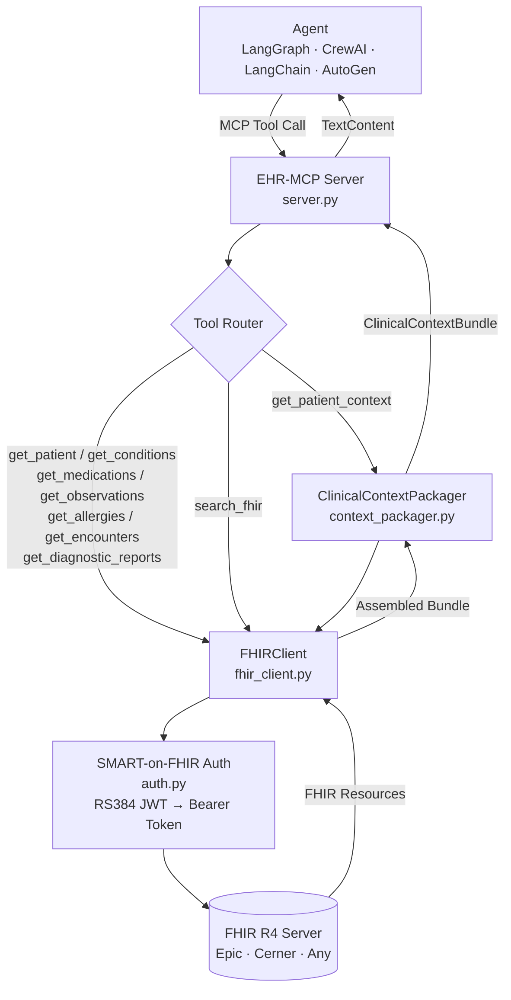

<div align="center">

<br />

# ⚕️ EHR-MCP

**Every healthcare AI team builds the same EHR integration layer from scratch.**  
**SMART-on-FHIR auth. FHIR R4 client. Vendor normalization. Data contract.**  
**Every. Single. Team.**

EHR-MCP is that layer — **built once, reusable across every agent in your stack.**  
One protocol. Any EHR. Any agent framework.

<br />

[](https://github.com/jsfaulkner86/ehr-mcp/stargazers)
[](https://github.com/jsfaulkner86/ehr-mcp/network/members)
[](https://github.com/jsfaulkner86/ehr-mcp/issues)

<br />

[](https://python.org)
[](https://hl7.org/fhir/R4/)
[](https://modelcontextprotocol.io)
[](https://hl7.org/fhir/smart-app-launch/backend-services.html)
[](#ehr-compatibility)
[](#docker)
[](#claude-desktop)
[](#cursor--windsurf)
[](https://doi.org/10.48550/arXiv.2509.15957)
[](LICENSE)

<br />

[MCP Tool Reference](#mcp-tool-reference) · [ClinicalContextBundle](#clinicalcontextbundle) · [Quick Start](#getting-started) · [Agent Integration](#connecting-an-agent) · [Roadmap](#roadmap)

<br />

</div>

---

## The Problem Every Healthcare AI Team Has

I've watched this happen across 12 enterprise Epic health system deployments. A team decides to build a clinical AI agent. They have an LLM. They have a workflow. Then they hit the EHR integration wall:

> SMART-on-FHIR app registration. RS384 JWT key pair generation. Token exchange implementation. FHIR R4 resource fetching. Vendor-specific quirk normalization. A typed data contract that downstream agents can actually work with.

That's 2–4 weeks of infrastructure work before a single agent prompt is written. And every team at every health system in every agentic AI product company is doing it **from scratch**.

EHR-MCP is the protocol layer that eliminates that work. Your agent calls `get_patient_context(patient_id)`. It gets back a typed `ClinicalContextBundle`. The auth, the FHIR parsing, the vendor normalization — handled.

---

## How It Works

```
Agent (LangGraph / CrewAI / LangChain / AutoGen)
        │
        │  MCP Tool Call: get_patient_context(patient_id)
        ▼
   ┌─────────────────────────────────────────┐
   │            EHR-MCP Server               │
   │                                         │
   │  ┌─ SMART-on-FHIR Auth (RS384 JWT) ──┐  │
   │  ├─ FHIR R4 Resource Fetch ──────────┤  │
   │  └─ ClinicalContextBundle Assembly ──┘  │
   └─────────────────────────────────────────┘
        │
        ▼
   Structured ClinicalContextBundle → returned to agent
```



---

## MCP Tool Reference

| Tool | FHIR Resource(s) | Description |
|---|---|---|
| `get_patient_context` | Bundle (all) | Full clinical context bundle — the primary tool for any workflow agent |
| `get_patient` | `Patient` | Demographics, identifiers, contact info |
| `get_conditions` | `Condition` | Active diagnoses with ICD-10 codes |
| `get_medications` | `MedicationRequest` | Active prescriptions with dosage and prescriber |
| `get_observations` | `Observation` | Labs and vitals with LOINC codes and values |
| `get_allergies` | `AllergyIntolerance` | Allergy list with reaction severity |
| `get_encounters` | `Encounter` | Visit history with type, class, and dates |
| `get_diagnostic_reports` | `DiagnosticReport` | Imaging, pathology, and procedure reports |
| `search_fhir` | Any `FHIRResourceType` | Raw FHIR search for advanced agent use cases |

---

## ClinicalContextBundle

Every `get_patient_context` call returns a typed `ClinicalContextBundle` — a Pydantic v2 model that gives downstream agents a **consistent, predictable data contract** regardless of which EHR vendor is on the other end.

```python
class ClinicalContextBundle(BaseModel):
    patient_id: str
    patient: Optional[dict]           # FHIR Patient resource
    conditions: List[dict]            # Active Condition resources
    medications: List[dict]           # Active MedicationRequest resources
    allergies: List[dict]             # AllergyIntolerance resources
    observations: List[dict]          # Observation resources (labs + vitals)
    encounters: List[dict]            # Encounter history
    diagnostic_reports: List[dict]    # DiagnosticReport resources
    vendor: Optional[str]             # EHR vendor detected from FHIR metadata
    fhir_version: str                 # Default: "R4"
```

> Agents receive a **normalized bundle**, not raw FHIR JSON. Vendor normalization happens inside EHR-MCP — not inside every agent.

---

## Authentication

EHR-MCP implements [SMART on FHIR Backend Services](https://hl7.org/fhir/smart-app-launch/backend-services.html) — the standard for system-to-system EHR access used by Epic, Cerner, and most FHIR R4-compliant platforms.

- **Auth flow:** RS384 JWT assertion → token exchange → Bearer token on all FHIR requests
- **No user login required** — designed for backend agent workflows
- **Epic-compatible** — aligns with Epic's Non-Patient-Facing App registration requirements

---

## EHR Compatibility

| EHR Platform | FHIR R4 | SMART Backend Services | Status |
|---|:---:|:---:|---|
| Epic | ✅ | ✅ | Sandbox tested |
| Cerner (Oracle Health) | ✅ | ✅ | Planned |
| Meditech Expanse | ✅ | ✅ | Planned |
| Any FHIR R4 Server | ✅ | ✅ | Via `FHIR_BASE_URL` |

---

## Getting Started

Choose your install method:

<details open>
<summary><b>🐍 Python (pip)</b></summary>

```bash
git clone https://github.com/jsfaulkner86/ehr-mcp
cd ehr-mcp
python -m venv venv
source venv/bin/activate  # Windows: venv\Scripts\activate
pip install -r requirements.txt
cp .env.example .env
python main.py
```

</details>

<details>
<summary><b>🐳 Docker</b></summary>

```bash
docker build -t ehr-mcp .
docker run --env-file .env ehr-mcp
```

Or with Docker Compose:

```yaml
# docker-compose.yml
services:
  ehr-mcp:
    build: .
    env_file: .env
    stdin_open: true
    tty: true
```

```bash
docker compose up
```

</details>

<details>
<summary><b>🤖 Claude Desktop</b></summary>

Add to your `claude_desktop_config.json`:

```json
{
  "mcpServers": {
    "ehr-mcp": {
      "command": "python",
      "args": ["-m", "ehr_mcp.server"],
      "cwd": "/path/to/ehr-mcp",
      "env": {
        "FHIR_BASE_URL": "https://fhir.epic.com/interconnect-fhir-oauth/api/FHIR/R4",
        "SMART_TOKEN_URL": "https://fhir.epic.com/interconnect-fhir-oauth/oauth2/token",
        "SMART_CLIENT_ID": "your_client_id",
        "SMART_PRIVATE_KEY_PATH": "/path/to/private_key.pem"
      }
    }
  }
}
```

Restart Claude Desktop. You'll see EHR tools available in the tool picker.

</details>

<details>
<summary><b>🖱️ Cursor / Windsurf</b></summary>

Add to your MCP config (`.cursor/mcp.json` or `.codeium/windsurf/mcp_config.json`):

```json
{
  "mcpServers": {
    "ehr-mcp": {
      "command": "python",
      "args": ["-m", "ehr_mcp.server"],
      "cwd": "/path/to/ehr-mcp",
      "env": {
        "FHIR_BASE_URL": "your_fhir_base_url",
        "SMART_TOKEN_URL": "your_token_url",
        "SMART_CLIENT_ID": "your_client_id",
        "SMART_PRIVATE_KEY_PATH": "/path/to/private_key.pem"
      }
    }
  }
}
```

Reload your editor. EHR-MCP tools will be available to your AI coding assistant.

</details>

### Environment Variables

```env
FHIR_BASE_URL=https://fhir.epic.com/interconnect-fhir-oauth/api/FHIR/R4
SMART_TOKEN_URL=https://fhir.epic.com/interconnect-fhir-oauth/oauth2/token
SMART_CLIENT_ID=your_client_id
SMART_PRIVATE_KEY_PATH=./keys/private_key.pem
MCP_SERVER_NAME=ehr-mcp
MCP_SERVER_VERSION=0.1.0
OPENAI_API_KEY=your_key_here   # Only required for summary generation
```

**Epic FHIR Sandbox:** [fhir.epic.com](https://fhir.epic.com) — free registration, full R4 resource access for development.

---

## Connecting an Agent

```python
# LangGraph + langchain-mcp-adapters
from langchain_mcp_adapters.client import MultiServerMCPClient

async with MultiServerMCPClient({
    "ehr": {
        "command": "python",
        "args": ["-m", "ehr_mcp.server"],
        "transport": "stdio",
    }
}) as client:
    tools = client.get_tools()
    # tools now includes get_patient_context, get_conditions, etc.
    # Works identically with CrewAI, LangChain, AutoGen
```

Any MCP-compatible agent framework connects the same way — no framework-specific integration code required.

---

## Use It With These Agents

EHR-MCP is the shared data layer for the healthcare agent portfolio. Any agent that needs patient context calls in through here:

| Agent | Integration Point |
|---|---|
| [`clinical-triage-agent`](https://github.com/jsfaulkner86/clinical-triage-agent) | Patient context for acuity classification |
| [`pph-risk-scoring-agent`](https://github.com/jsfaulkner86/pph-risk-scoring-agent) | Live vitals + labs for risk scoring |
| [`prior-auth-research-agent`](https://github.com/jsfaulkner86/prior-auth-research-agent) | Diagnosis + medication context for auth criteria |
| [`healthcare-compliance-guardrail`](https://github.com/jsfaulkner86/healthcare-compliance-guardrail) | PHI-safe patient context delivery |
| Your custom agent | Any MCP-compatible framework |

---

## Academic Validation

This implementation was inspired by peer-reviewed research validating LLM + EHR-MCP in a live hospital environment:

> **EHR-MCP: Real-world Evaluation of Clinical Information Retrieval by Large Language Models via Model Context Protocol**  
> Masayoshi et al. — *arXiv:2509.15957* — [https://doi.org/10.48550/arXiv.2509.15957](https://doi.org/10.48550/arXiv.2509.15957)

Their study demonstrated near-perfect MCP tool selection accuracy using GPT-4.1 + LangGraph ReAct in a live hospital EHR. This repository extends that concept with vendor-agnostic FHIR abstraction, SMART Backend Services auth, multi-framework compatibility, and a fully open-source implementation.

---

## Known Failure Modes

Production healthcare AI needs an honest failure mode table. Here's mine.

| Failure Mode | Impact | Mitigation |
|---|---|---|
| Epic FHIR rate limiting | Bundle assembly delays under load | Exponential backoff + per-resource timeout handling |
| RS384 token expiry during long agent session | Silent FHIR auth failure | Pre-expiry token refresh with 5-min rotation buffer |
| Vendor FHIR quirks (non-standard resource shapes) | Normalization failures | Vendor-specific adapters in roadmap; current Epic validation tested |
| PHI in raw `search_fhir` output | Unmasked PHI reaching agent | Route through [`healthcare-compliance-guardrail`](https://github.com/jsfaulkner86/healthcare-compliance-guardrail) for PHI-safe delivery |

---

## Roadmap

- [ ] Epic FHIR sandbox end-to-end integration test suite
- [ ] Bidirectional write support (`Task`, `Communication`, `ServiceRequest`)
- [ ] `Coverage` + `Claim` tools for prior auth workflows
- [ ] Cerner (Oracle Health) validation
- [ ] OpenAPI spec for REST-based agent integration

---

## If You're Building Healthcare AI

If this protocol is useful to you, a ⭐ helps others find it.

If you're a health system or women's health tech company building multi-agent clinical AI and need the interoperability layer designed properly — this is the kind of infrastructure I architect at [The Faulkner Group](https://thefaulknergroupadvisors.com).

---

<div align="center">

*The connective tissue for multi-agent healthcare AI.*

*Part of The Faulkner Group's healthcare agentic AI portfolio → [github.com/jsfaulkner86](https://github.com/jsfaulkner86)*  
*Built from 14 years and 12 Epic enterprise health system deployments.*

</div>
